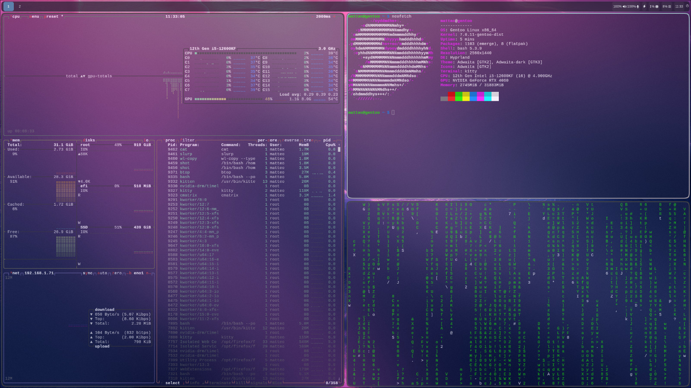

# Hyprland Setup – Matteo

## Screenshot

Configurazione personale di Hyprland ottimizzata per performance, minimalismo e workflow da sviluppatore.

## Caratteristiche principali
- Tiling dinamico con layout personalizzati
- Waybar minimal e reattiva
- Supporto completo a Wayland (portali, screenshot, clipboard)
- Animazioni leggere e fluide
- Configurazione modulare (divisa in più file)

## Tecnologie usate
- Hyprland
- Waybar
- Hyprpaper
- wl-clipboard
- grim + slurp
- xdg-desktop-portal-wlr
- polkit-gnome
- wofi
- thunar
- alacritty / foot 
- nm-applet
- xwaylandvideobridge
- firefox
- hyprshade

## Struttura del repo


## Installazione
```
mkdir ~/.config/hypr
git clone https://github.com/Matteo7034/Mhyprland7034.git ~/.config/hypr/
```

## Note
Setup testato su:
- Desktop GPU nvidia
- Gentoo
